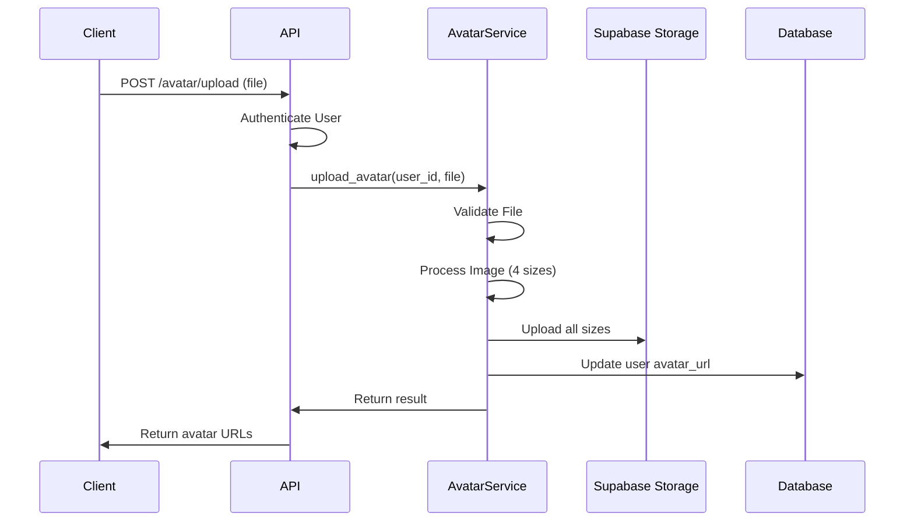

# 📋 BRAND LOGO VE PRODUCT IMAGE UPLOAD SİSTEMİ PLANLAMASI

## İçindekiler
1. [Mevcut Sistem Analizi](#mevcut-sistem-analizi)
2. [Yeni Sistem Planlaması](#yeni-sistem-planlamasi)
3. [Implementation Adımları](#implementation-adimlari)
4. [Güvenlik ve Performans](#guvenlik-ve-performans)
5. [Test Senaryoları](#test-senaryolari)
6. [Önemli Notlar](#onemli-notlar)

---

## 🔍 MEVCUT SİSTEM ANALİZİ

### Avatar Upload Sistemi (Referans Alınan Mevcut Sistem)

#### 1. Dosya Yapısı
```
app/
├── services/
│   └── avatar_service.py           # Avatar işlemleri için service class
├── routers/
│   └── auth.py                     # Avatar upload/delete endpoint'leri
└── config.py                       # Storage ayarları
```

#### 2. Kullanılan Teknolojiler
- **Supabase Storage**: Dosya depolama sistemi
- **PIL (Pillow)**: Resim işleme ve boyutlandırma kütüphanesi
- **FastAPI UploadFile**: Dosya yükleme mekanizması
- **Python asyncio**: Asenkron işlemler

#### 3. Avatar Sistemi Özellikleri

**Dosya Validasyonu:**
```python
allowed_extensions = {'jpg', 'jpeg', 'png', 'webp'}
allowed_mime_types = {'image/jpeg', 'image/jpg', 'image/png', 'image/webp'}
max_file_size = 5 * 1024 * 1024  # 5MB
```

**Resim İşleme:**
- 4 farklı boyut üretimi:
  - `thumbnail`: 64x64px
  - `small`: 128x128px
  - `medium`: 256x256px
  - `large`: 512x512px
- JPEG formatına dönüştürme
- Otomatik optimizasyon (quality=90)
- Aspect ratio koruması

**Storage Yapısı:**
```
user-avatars/                       # Bucket adı
└── {user_id}/                      # Kullanıcı klasörü
    ├── avatar_thumbnail.jpg        # 64x64
    ├── avatar_small.jpg            # 128x128
    ├── avatar_medium.jpg           # 256x256
    └── avatar_large.jpg            # 512x512
```

#### 4. Endpoint Yapısı

```python
POST   /api/v1/auth/avatar/upload     # Avatar yükle
DELETE /api/v1/auth/avatar            # Avatar sil
GET    /api/v1/auth/me                # Avatar URL'i al (profile içinde)
```

**Upload Endpoint Detayı:**
```python
@router.post("/avatar/upload")
async def upload_avatar(
    file: UploadFile = File(...),
    current_user: Dict[str, Any] = Depends(get_current_user)
):
    """
    Upload user avatar image
    - Validates file type and size
    - Processes image into multiple sizes
    - Uploads to Supabase Storage
    - Updates user record in database
    """
    user_id = current_user["id"]
    result = await avatar_service.upload_avatar(user_id, file)
    return result
```

#### 5. AvatarService Class Yapısı

**Ana Metodlar:**

```python
class AvatarService:
    async def upload_avatar(user_id: str, file: UploadFile) -> Dict[str, Any]:
        """
        1. Dosya validasyonu (_validate_file)
        2. Resim işleme (_process_image)
        3. Tüm boyutları storage'a yükleme
        4. Database güncelleme (_update_user_avatar)
        """

    async def delete_avatar(user_id: str) -> Dict[str, Any]:
        """
        1. Tüm boyutları storage'dan sil
        2. Database'de avatar_url = NULL
        """

    async def get_avatar_url(user_id: str, size: str = "large") -> Optional[str]:
        """
        Storage'dan avatar URL'i al
        """

    async def _validate_file(file: UploadFile) -> None:
        """
        - Dosya boyutu kontrolü
        - MIME type kontrolü
        - Extension kontrolü
        """

    async def _process_image(file_content: bytes) -> Dict[str, bytes]:
        """
        - PIL ile resim aç
        - RGBA -> RGB dönüşümü
        - 4 farklı boyutta resize
        - JPEG olarak kaydet
        """

    async def _update_user_avatar(user_id: str, avatar_url: str) -> None:
        """
        Database'de users tablosunu güncelle:
        - avatar_url
        - avatar_type
        - avatar_updated_at
        """
```

#### 6. Config Ayarları

```python
# app/config.py
class Settings(BaseSettings):
    # Supabase Storage
    supabase_url: str
    supabase_api_key: str

    # Avatar Settings
    supabase_storage_bucket: str = "user-avatars"
    avatar_base_url: Optional[str] = None
```

#### 7. Database Schema

```sql
-- users tablosu
CREATE TABLE users (
    id UUID PRIMARY KEY,
    email TEXT NOT NULL,
    full_name TEXT,
    avatar_url TEXT,              -- Storage'daki avatar URL'i
    avatar_type TEXT DEFAULT 'gravatar',  -- 'upload', 'gravatar', 'initials'
    avatar_updated_at TIMESTAMP,
    created_at TIMESTAMP,
    updated_at TIMESTAMP
);
```

#### 8. İş Akışı (Workflow)



---

## 🎯 YENİ SİSTEM PLANLAMASI

### A. BRAND LOGO UPLOAD SİSTEMİ

#### 1. Dosya Yapısı (Oluşturulacak)

```
app/
├── services/
│   ├── avatar_service.py           # MEVCUT - Değişmeyecek
│   └── brand_logo_service.py       # YENİ - Brand logo işlemleri
├── routers/
│   └── brands.py                   # Mevcut - YENİ endpoint'ler eklenecek
└── config.py                       # Mevcut - YENİ ayarlar eklenecek
```

#### 2. Storage Yapısı

```
brand-logos/                        # YENİ Supabase Bucket
└── {brand_id}/                     # Brand UUID klasörü
    ├── logo_thumbnail.png          # 64x64
    ├── logo_small.png              # 128x128
    ├── logo_medium.png             # 256x256
    └── logo_large.png              # 512x512
```

**Neden PNG?**
- Logo'lar genellikle şeffaf arka plan içerir
- SVG desteği için PNG alternatif
- Daha iyi kenar kalitesi

#### 3. BrandLogoService Class (brand_logo_service.py)

```python
# app/services/brand_logo_service.py
"""
Brand Logo Service for MarkaMind Platform
Handles brand logo upload, processing, and management operations
"""

import os
import mimetypes
from typing import Optional, Dict, Any
from io import BytesIO
from datetime import datetime, timezone
import logging

from PIL import Image, ImageOps
from fastapi import UploadFile, HTTPException
from supabase import create_client, Client
from app.config import settings

logger = logging.getLogger(__name__)

class BrandLogoService:
    """Service for managing brand logos"""

    def __init__(self):
        # Supabase client initialization
        if not settings.supabase_url or not settings.supabase_api_key:
            raise ValueError("Supabase credentials not found")

        self.client: Client = create_client(
            settings.supabase_url,
            settings.supabase_api_key
        )
        self.bucket_name = settings.brand_logo_bucket
        self.base_url = settings.brand_logo_base_url or \
            f"{settings.supabase_url}/storage/v1/object/public/{self.bucket_name}/"

        # Configuration
        self.allowed_extensions = {'jpg', 'jpeg', 'png', 'svg', 'webp'}
        self.allowed_mime_types = {
            'image/jpeg', 'image/jpg', 'image/png',
            'image/svg+xml', 'image/webp'
        }
        self.max_file_size = 2 * 1024 * 1024  # 2MB (Logo'lar küçük olmalı)

        # Logo boyutları (Avatar'dan farklı)
        self.logo_sizes = {
            'thumbnail': (64, 64),      # Sidebar, listeler
            'small': (128, 128),        # Navbar
            'medium': (256, 256),       # Brand detay sayfası
            'large': (512, 512)         # Büyük gösterimler
        }

    async def upload_logo(
        self,
        brand_id: str,
        file: UploadFile
    ) -> Dict[str, Any]:
        """
        Upload and process brand logo

        Args:
            brand_id: Brand UUID
            file: Uploaded logo file

        Returns:
            Dict containing logo information
        """
        try:
            # 1. Validate file
            await self._validate_file(file)

            # 2. Read file content
            file_content = await file.read()

            # 3. Process image (4 sizes)
            processed_images = await self._process_image(file_content)

            # 4. Upload all sizes to storage
            upload_results = {}
            for size_name, image_data in processed_images.items():
                file_path = f"{brand_id}/logo_{size_name}.png"

                try:
                    # Remove existing file if exists
                    try:
                        self.client.storage.from_(self.bucket_name).remove([file_path])
                    except:
                        pass

                    # Upload new file
                    result = self.client.storage.from_(self.bucket_name).upload(
                        path=file_path,
                        file=image_data,
                        file_options={"content-type": "image/png"}
                    )

                    upload_results[size_name] = {
                        "path": file_path,
                        "url": f"{self.base_url}{file_path}",
                        "size": len(image_data)
                    }

                except Exception as e:
                    logger.error(f"Upload failed for {size_name}: {e}")
                    raise HTTPException(
                        status_code=500,
                        detail=f"Failed to upload {size_name} logo"
                    )

            # 5. Update brand record in database
            await self._update_brand_logo(brand_id, upload_results['large']['url'])

            return {
                "success": True,
                "logo_url": upload_results['large']['url'],
                "sizes": upload_results,
                "file_size": len(file_content),
                "uploaded_at": datetime.now(timezone.utc).isoformat()
            }

        except HTTPException:
            raise
        except Exception as e:
            logger.error(f"Logo upload error: {e}")
            raise HTTPException(
                status_code=500,
                detail="Logo upload failed"
            )

    async def delete_logo(self, brand_id: str) -> Dict[str, Any]:
        """
        Delete brand logo from storage and database

        Args:
            brand_id: Brand UUID

        Returns:
            Dict containing deletion result
        """
        try:
            # Delete all logo sizes from storage
            deleted_files = []
            for size_name in self.logo_sizes.keys():
                file_path = f"{brand_id}/logo_{size_name}.png"

                try:
                    result = self.client.storage.from_(self.bucket_name).remove([file_path])
                    deleted_files.append(file_path)
                except Exception as e:
                    logger.warning(f"Failed to delete {file_path}: {e}")

            # Update brand record - remove logo
            await self._update_brand_logo(brand_id, None)

            return {
                "success": True,
                "deleted_files": deleted_files,
                "message": "Logo deleted successfully"
            }

        except Exception as e:
            logger.error(f"Logo deletion error: {e}")
            raise HTTPException(
                status_code=500,
                detail="Logo deletion failed"
            )

    async def get_logo_url(
        self,
        brand_id: str,
        size: str = "large"
    ) -> Optional[str]:
        """
        Get logo URL for brand

        Args:
            brand_id: Brand UUID
            size: Logo size (thumbnail, small, medium, large)

        Returns:
            Logo URL or None
        """
        try:
            if size not in self.logo_sizes:
                size = "large"

            file_path = f"{brand_id}/logo_{size}.png"

            # Check if file exists in storage
            try:
                files = self.client.storage.from_(self.bucket_name).list(brand_id)
                logo_exists = any(
                    f.get('name') == f"logo_{size}.png"
                    for f in files
                )

                if logo_exists:
                    return f"{self.base_url}{file_path}"

            except Exception as e:
                logger.warning(f"Error checking logo existence: {e}")

            return None

        except Exception as e:
            logger.error(f"Get logo URL error: {e}")
            return None

    async def _validate_file(self, file: UploadFile) -> None:
        """Validate uploaded file"""
        # Check file size
        file.file.seek(0, 2)
        file_size = file.file.tell()
        file.file.seek(0)

        if file_size > self.max_file_size:
            raise HTTPException(
                status_code=413,
                detail=f"File too large. Maximum size is {self.max_file_size // (1024*1024)}MB"
            )

        # Check MIME type
        if file.content_type not in self.allowed_mime_types:
            raise HTTPException(
                status_code=400,
                detail=f"Invalid file type. Allowed types: {', '.join(self.allowed_mime_types)}"
            )

        # Check file extension
        if file.filename:
            extension = file.filename.split('.')[-1].lower()
            if extension not in self.allowed_extensions:
                raise HTTPException(
                    status_code=400,
                    detail=f"Invalid file extension. Allowed: {', '.join(self.allowed_extensions)}"
                )

    async def _process_image(self, file_content: bytes) -> Dict[str, bytes]:
        """Process image into different sizes"""
        try:
            # Open image with PIL
            image = Image.open(BytesIO(file_content))

            # Preserve transparency for PNG
            # Convert to RGBA if not already
            if image.mode != 'RGBA':
                image = image.convert('RGBA')

            # Process each size
            processed_images = {}
            for size_name, (width, height) in self.logo_sizes.items():
                # Resize image maintaining aspect ratio
                resized_image = ImageOps.fit(
                    image,
                    (width, height),
                    Image.Resampling.LANCZOS
                )

                # Save to bytes as PNG
                output = BytesIO()
                resized_image.save(
                    output,
                    format='PNG',
                    optimize=True
                )
                processed_images[size_name] = output.getvalue()

            return processed_images

        except Exception as e:
            logger.error(f"Image processing error: {e}")
            raise HTTPException(
                status_code=400,
                detail="Invalid image file or processing failed"
            )

    async def _update_brand_logo(
        self,
        brand_id: str,
        logo_url: Optional[str]
    ) -> None:
        """Update brand logo in database"""
        try:
            update_data = {
                "logo_url": logo_url,
                "updated_at": datetime.now(timezone.utc).isoformat()
            }

            result = self.client.table("brands").update(update_data).eq("id", brand_id).execute()

            if not result.data:
                logger.warning(f"No brand found with ID: {brand_id}")

        except Exception as e:
            logger.error(f"Database update error: {e}")
            raise HTTPException(
                status_code=500,
                detail="Failed to update brand logo in database"
            )

# Create service instance
brand_logo_service = BrandLogoService()
```

#### 4. Router Endpoint'leri (brands.py'ye eklenecek)

```python
# app/routers/brands.py

from fastapi import APIRouter, Depends, File, UploadFile, HTTPException
from app.services.brand_logo_service import brand_logo_service
from app.dependencies import get_current_user, get_supabase_client

# Mevcut router'a eklenecek endpoint'ler:

@router.post("/{brand_id}/logo/upload")
async def upload_brand_logo(
    brand_id: UUID,
    file: UploadFile = File(...),
    current_user: dict = Depends(get_current_user),
    supabase = Depends(get_supabase_client)
):
    """
    Upload brand logo

    - Validates brand ownership
    - Uploads logo to storage
    - Returns logo URLs for all sizes
    """
    try:
        # Verify brand belongs to user
        brand_check = supabase.table("brands").select("id").eq(
            "id", str(brand_id)
        ).eq("user_id", current_user["id"]).execute()

        if not brand_check.data:
            raise HTTPException(
                status_code=404,
                detail="Brand not found or you don't have permission"
            )

        # Upload logo
        result = await brand_logo_service.upload_logo(str(brand_id), file)

        return result

    except HTTPException:
        raise
    except Exception as e:
        raise HTTPException(
            status_code=500,
            detail=f"Failed to upload logo: {str(e)}"
        )


@router.delete("/{brand_id}/logo")
async def delete_brand_logo(
    brand_id: UUID,
    current_user: dict = Depends(get_current_user),
    supabase = Depends(get_supabase_client)
):
    """
    Delete brand logo

    - Validates brand ownership
    - Deletes logo from storage
    - Updates database
    """
    try:
        # Verify brand belongs to user
        brand_check = supabase.table("brands").select("id").eq(
            "id", str(brand_id)
        ).eq("user_id", current_user["id"]).execute()

        if not brand_check.data:
            raise HTTPException(
                status_code=404,
                detail="Brand not found or you don't have permission"
            )

        # Delete logo
        result = await brand_logo_service.delete_logo(str(brand_id))

        return result

    except HTTPException:
        raise
    except Exception as e:
        raise HTTPException(
            status_code=500,
            detail=f"Failed to delete logo: {str(e)}"
        )


@router.get("/{brand_id}/logo/{size}")
async def get_brand_logo_url(
    brand_id: UUID,
    size: str = "large",
    current_user: dict = Depends(get_current_user),
    supabase = Depends(get_supabase_client)
):
    """
    Get brand logo URL for specific size

    - Validates brand ownership
    - Returns logo URL
    """
    try:
        # Verify brand belongs to user
        brand_check = supabase.table("brands").select("id").eq(
            "id", str(brand_id)
        ).eq("user_id", current_user["id"]).execute()

        if not brand_check.data:
            raise HTTPException(
                status_code=404,
                detail="Brand not found or you don't have permission"
            )

        # Get logo URL
        logo_url = await brand_logo_service.get_logo_url(str(brand_id), size)

        if not logo_url:
            raise HTTPException(
                status_code=404,
                detail="Logo not found"
            )

        return {"logo_url": logo_url}

    except HTTPException:
        raise
    except Exception as e:
        raise HTTPException(
            status_code=500,
            detail=f"Failed to get logo URL: {str(e)}"
        )
```

#### 5. Config Ayarları (config.py'ye eklenecek)

```python
# app/config.py

class Settings(BaseSettings):
    # Mevcut ayarlar...

    # Brand Logo Storage Configuration (YENİ)
    brand_logo_bucket: str = "brand-logos"
    brand_logo_base_url: Optional[str] = None
```

#### 6. Database Değişiklikleri

```sql
-- brands tablosunda logo_url zaten var
-- Değişiklik gerekmez

SELECT id, name, logo_url FROM brands;
```

---

### B. PRODUCT IMAGE UPLOAD SİSTEMİ

#### 1. Dosya Yapısı (Oluşturulacak)

```
app/
├── services/
│   ├── avatar_service.py           # MEVCUT
│   ├── brand_logo_service.py       # Brand için oluşturulacak
│   └── product_image_service.py    # YENİ - Product image işlemleri
├── routers/
│   └── products.py                 # Mevcut - Endpoint'ler implement edilecek
└── config.py                       # Mevcut - YENİ ayarlar eklenecek
```

#### 2. Storage Yapısı

```
product-images/                     # YENİ Supabase Bucket
└── {product_id}/                   # Ürün UUID klasörü
    ├── image_1_thumbnail.jpg       # 64x64 - Liste görünümü
    ├── image_1_small.jpg           # 200x200 - Kart görünümü
    ├── image_1_medium.jpg          # 500x500 - Detay sayfası
    ├── image_1_large.jpg           # 1000x1000 - Zoom
    ├── image_2_thumbnail.jpg       # İkinci resim
    ├── image_2_small.jpg
    ├── image_2_medium.jpg
    ├── image_2_large.jpg
    └── ...                         # Daha fazla resim
```

**Önemli Fark:**
- Her ürün için ÇOKLU resim
- Her resim için INDEX numarası (1, 2, 3...)
- Her resim 4 farklı boyutta

#### 3. ProductImageService Class (product_image_service.py)

```python
# app/services/product_image_service.py
"""
Product Image Service for MarkaMind Platform
Handles product image upload, processing, and management operations
Supports multiple images per product with ordering
"""

import os
import mimetypes
from typing import Optional, Dict, Any, List
from io import BytesIO
from datetime import datetime, timezone
import logging

from PIL import Image, ImageOps
from fastapi import UploadFile, HTTPException
from supabase import create_client, Client
from app.config import settings

logger = logging.getLogger(__name__)

class ProductImageService:
    """Service for managing product images"""

    def __init__(self):
        # Supabase client initialization
        if not settings.supabase_url or not settings.supabase_api_key:
            raise ValueError("Supabase credentials not found")

        self.client: Client = create_client(
            settings.supabase_url,
            settings.supabase_api_key
        )
        self.bucket_name = settings.product_image_bucket
        self.base_url = settings.product_image_base_url or \
            f"{settings.supabase_url}/storage/v1/object/public/{self.bucket_name}/"

        # Configuration
        self.allowed_extensions = {'jpg', 'jpeg', 'png', 'webp'}
        self.allowed_mime_types = {
            'image/jpeg', 'image/jpg', 'image/png', 'image/webp'
        }
        self.max_file_size = 10 * 1024 * 1024  # 10MB (Ürün resimleri daha büyük)
        self.max_images_per_product = 10  # Max 10 resim per ürün

        # Image boyutları (E-commerce için optimize)
        self.image_sizes = {
            'thumbnail': (64, 64),      # Liste/grid görünümü
            'small': (200, 200),        # Kart görünümü
            'medium': (500, 500),       # Detay sayfası ana resim
            'large': (1000, 1000)       # Zoom/büyütme özelliği
        }

    async def upload_image(
        self,
        product_id: str,
        file: UploadFile,
        display_order: int = 0,
        is_primary: bool = False
    ) -> Dict[str, Any]:
        """
        Upload single product image

        Args:
            product_id: Product UUID
            file: Uploaded image file
            display_order: Image order (0-based)
            is_primary: Mark as primary/main image

        Returns:
            Dict containing image information with image_id
        """
        try:
            # 1. Check image count limit
            current_count = await self._get_image_count(product_id)
            if current_count >= self.max_images_per_product:
                raise HTTPException(
                    status_code=400,
                    detail=f"Maximum {self.max_images_per_product} images allowed per product"
                )

            # 2. Validate file
            await self._validate_file(file)

            # 3. Read file content
            file_content = await file.read()

            # 4. Get next image index
            next_index = current_count + 1

            # 5. Process image (4 sizes)
            processed_images = await self._process_image(file_content)

            # 6. Upload all sizes to storage
            upload_results = {}
            for size_name, image_data in processed_images.items():
                file_path = f"{product_id}/image_{next_index}_{size_name}.jpg"

                try:
                    # Remove existing file if exists (upsert)
                    try:
                        self.client.storage.from_(self.bucket_name).remove([file_path])
                    except:
                        pass

                    # Upload new file
                    result = self.client.storage.from_(self.bucket_name).upload(
                        path=file_path,
                        file=image_data,
                        file_options={"content-type": "image/jpeg"}
                    )

                    upload_results[size_name] = {
                        "path": file_path,
                        "url": f"{self.base_url}{file_path}",
                        "size": len(image_data)
                    }

                except Exception as e:
                    logger.error(f"Upload failed for {size_name}: {e}")
                    raise HTTPException(
                        status_code=500,
                        detail=f"Failed to upload {size_name} image"
                    )

            # 7. Create image record in database
            image_id = await self._create_image_record(
                product_id=product_id,
                image_url=upload_results['large']['url'],
                thumbnail_url=upload_results['thumbnail']['url'],
                display_order=display_order,
                is_primary=is_primary
            )

            # 8. If primary, update other images
            if is_primary:
                await self._unset_other_primary_images(product_id, image_id)

            return {
                "success": True,
                "image_id": image_id,
                "image_url": upload_results['large']['url'],
                "thumbnail_url": upload_results['thumbnail']['url'],
                "sizes": upload_results,
                "display_order": display_order,
                "is_primary": is_primary,
                "file_size": len(file_content),
                "uploaded_at": datetime.now(timezone.utc).isoformat()
            }

        except HTTPException:
            raise
        except Exception as e:
            logger.error(f"Product image upload error: {e}")
            raise HTTPException(
                status_code=500,
                detail="Product image upload failed"
            )

    async def upload_multiple_images(
        self,
        product_id: str,
        files: List[UploadFile]
    ) -> List[Dict[str, Any]]:
        """
        Upload multiple product images at once

        Args:
            product_id: Product UUID
            files: List of uploaded image files

        Returns:
            List of upload results
        """
        try:
            # Check total count
            current_count = await self._get_image_count(product_id)
            if current_count + len(files) > self.max_images_per_product:
                raise HTTPException(
                    status_code=400,
                    detail=f"Would exceed maximum {self.max_images_per_product} images per product"
                )

            results = []
            for index, file in enumerate(files):
                # First image is primary if no images exist
                is_primary = (current_count == 0 and index == 0)
                display_order = current_count + index

                result = await self.upload_image(
                    product_id=product_id,
                    file=file,
                    display_order=display_order,
                    is_primary=is_primary
                )
                results.append(result)

            return results

        except HTTPException:
            raise
        except Exception as e:
            logger.error(f"Multiple image upload error: {e}")
            raise HTTPException(
                status_code=500,
                detail="Multiple image upload failed"
            )

    async def delete_image(self, image_id: str) -> Dict[str, Any]:
        """
        Delete single product image

        Args:
            image_id: Image record UUID

        Returns:
            Deletion result
        """
        try:
            # 1. Get image record
            image_record = await self._get_image_record(image_id)
            if not image_record:
                raise HTTPException(
                    status_code=404,
                    detail="Image not found"
                )

            product_id = image_record['product_id']

            # 2. Extract image index from URL
            # URL format: .../product_id/image_1_large.jpg
            image_url = image_record['image_url']
            image_index = self._extract_image_index(image_url)

            # 3. Delete all sizes from storage
            deleted_files = []
            for size_name in self.image_sizes.keys():
                file_path = f"{product_id}/image_{image_index}_{size_name}.jpg"

                try:
                    self.client.storage.from_(self.bucket_name).remove([file_path])
                    deleted_files.append(file_path)
                except Exception as e:
                    logger.warning(f"Failed to delete {file_path}: {e}")

            # 4. Delete database record
            await self._delete_image_record(image_id)

            # 5. If was primary, set another image as primary
            if image_record.get('is_primary'):
                await self._set_first_image_as_primary(product_id)

            return {
                "success": True,
                "deleted_files": deleted_files,
                "message": "Image deleted successfully"
            }

        except HTTPException:
            raise
        except Exception as e:
            logger.error(f"Image deletion error: {e}")
            raise HTTPException(
                status_code=500,
                detail="Image deletion failed"
            )

    async def delete_all_images(self, product_id: str) -> Dict[str, Any]:
        """
        Delete all images for a product

        Args:
            product_id: Product UUID

        Returns:
            Deletion result
        """
        try:
            # Get all image records
            images = await self._get_all_images(product_id)

            deleted_count = 0
            for image in images:
                try:
                    await self.delete_image(image['id'])
                    deleted_count += 1
                except Exception as e:
                    logger.warning(f"Failed to delete image {image['id']}: {e}")

            return {
                "success": True,
                "deleted_count": deleted_count,
                "message": f"Deleted {deleted_count} images"
            }

        except Exception as e:
            logger.error(f"Delete all images error: {e}")
            raise HTTPException(
                status_code=500,
                detail="Failed to delete all images"
            )

    async def set_primary_image(self, image_id: str) -> Dict[str, Any]:
        """
        Set an image as primary/main image

        Args:
            image_id: Image record UUID

        Returns:
            Update result
        """
        try:
            # Get image record
            image_record = await self._get_image_record(image_id)
            if not image_record:
                raise HTTPException(
                    status_code=404,
                    detail="Image not found"
                )

            product_id = image_record['product_id']

            # Unset all other primary images
            await self._unset_other_primary_images(product_id, image_id)

            # Set this as primary
            await self._update_image_primary(image_id, True)

            return {
                "success": True,
                "message": "Primary image updated"
            }

        except HTTPException:
            raise
        except Exception as e:
            logger.error(f"Set primary image error: {e}")
            raise HTTPException(
                status_code=500,
                detail="Failed to set primary image"
            )

    async def reorder_images(
        self,
        product_id: str,
        order_list: List[Dict[str, int]]
    ) -> Dict[str, Any]:
        """
        Reorder product images

        Args:
            product_id: Product UUID
            order_list: List of {"image_id": "...", "display_order": 0}

        Returns:
            Update result
        """
        try:
            for item in order_list:
                image_id = item['image_id']
                display_order = item['display_order']

                await self._update_image_order(image_id, display_order)

            return {
                "success": True,
                "message": f"Reordered {len(order_list)} images"
            }

        except Exception as e:
            logger.error(f"Reorder images error: {e}")
            raise HTTPException(
                status_code=500,
                detail="Failed to reorder images"
            )

    async def get_image_url(
        self,
        image_id: str,
        size: str = "large"
    ) -> Optional[str]:
        """
        Get image URL for specific size

        Args:
            image_id: Image record UUID
            size: Image size

        Returns:
            Image URL
        """
        try:
            if size not in self.image_sizes:
                size = "large"

            # Get image record
            image_record = await self._get_image_record(image_id)
            if not image_record:
                return None

            # Extract index and build URL
            image_url = image_record['image_url']
            image_index = self._extract_image_index(image_url)
            product_id = image_record['product_id']

            file_path = f"{product_id}/image_{image_index}_{size}.jpg"
            return f"{self.base_url}{file_path}"

        except Exception as e:
            logger.error(f"Get image URL error: {e}")
            return None

    # ========================================================================
    # PRIVATE HELPER METHODS
    # ========================================================================

    async def _validate_file(self, file: UploadFile) -> None:
        """Validate uploaded file"""
        # Check file size
        file.file.seek(0, 2)
        file_size = file.file.tell()
        file.file.seek(0)

        if file_size > self.max_file_size:
            raise HTTPException(
                status_code=413,
                detail=f"File too large. Maximum size is {self.max_file_size // (1024*1024)}MB"
            )

        # Check MIME type
        if file.content_type not in self.allowed_mime_types:
            raise HTTPException(
                status_code=400,
                detail=f"Invalid file type. Allowed types: {', '.join(self.allowed_mime_types)}"
            )

        # Check file extension
        if file.filename:
            extension = file.filename.split('.')[-1].lower()
            if extension not in self.allowed_extensions:
                raise HTTPException(
                    status_code=400,
                    detail=f"Invalid file extension. Allowed: {', '.join(self.allowed_extensions)}"
                )

    async def _process_image(self, file_content: bytes) -> Dict[str, bytes]:
        """Process image into different sizes"""
        try:
            # Open image with PIL
            image = Image.open(BytesIO(file_content))

            # Convert to RGB (JPEG doesn't support transparency)
            if image.mode in ('RGBA', 'LA', 'P'):
                background = Image.new('RGB', image.size, (255, 255, 255))
                if image.mode == 'P':
                    image = image.convert('RGBA')
                background.paste(image, mask=image.split()[-1] if image.mode == 'RGBA' else None)
                image = background

            # Process each size
            processed_images = {}
            for size_name, (width, height) in self.image_sizes.items():
                # Resize image maintaining aspect ratio
                resized_image = ImageOps.fit(
                    image,
                    (width, height),
                    Image.Resampling.LANCZOS
                )

                # Save to bytes as JPEG
                output = BytesIO()
                resized_image.save(
                    output,
                    format='JPEG',
                    quality=90,
                    optimize=True
                )
                processed_images[size_name] = output.getvalue()

            return processed_images

        except Exception as e:
            logger.error(f"Image processing error: {e}")
            raise HTTPException(
                status_code=400,
                detail="Invalid image file or processing failed"
            )

    async def _get_image_count(self, product_id: str) -> int:
        """Get current image count for product"""
        try:
            result = self.client.table("product_images").select(
                "id", count="exact"
            ).eq("product_id", product_id).execute()

            return result.count if result.count else 0

        except Exception as e:
            logger.error(f"Get image count error: {e}")
            return 0

    async def _create_image_record(
        self,
        product_id: str,
        image_url: str,
        thumbnail_url: str,
        display_order: int,
        is_primary: bool
    ) -> str:
        """Create image record in database"""
        try:
            image_data = {
                "product_id": product_id,
                "image_url": image_url,
                "thumbnail_url": thumbnail_url,
                "display_order": display_order,
                "is_primary": is_primary,
                "created_at": datetime.now(timezone.utc).isoformat(),
                "updated_at": datetime.now(timezone.utc).isoformat()
            }

            result = self.client.table("product_images").insert(image_data).execute()

            if not result.data:
                raise HTTPException(
                    status_code=500,
                    detail="Failed to create image record"
                )

            return result.data[0]['id']

        except Exception as e:
            logger.error(f"Create image record error: {e}")
            raise HTTPException(
                status_code=500,
                detail="Failed to create image record in database"
            )

    async def _get_image_record(self, image_id: str) -> Optional[Dict]:
        """Get image record from database"""
        try:
            result = self.client.table("product_images").select("*").eq("id", image_id).execute()

            if result.data:
                return result.data[0]
            return None

        except Exception as e:
            logger.error(f"Get image record error: {e}")
            return None

    async def _get_all_images(self, product_id: str) -> List[Dict]:
        """Get all images for a product"""
        try:
            result = self.client.table("product_images").select("*").eq(
                "product_id", product_id
            ).order("display_order").execute()

            return result.data if result.data else []

        except Exception as e:
            logger.error(f"Get all images error: {e}")
            return []

    async def _delete_image_record(self, image_id: str) -> None:
        """Delete image record from database"""
        try:
            result = self.client.table("product_images").delete().eq("id", image_id).execute()

            if not result.data:
                logger.warning(f"No image record deleted for ID: {image_id}")

        except Exception as e:
            logger.error(f"Delete image record error: {e}")
            raise

    async def _unset_other_primary_images(
        self,
        product_id: str,
        except_image_id: str
    ) -> None:
        """Unset primary flag for all other images"""
        try:
            self.client.table("product_images").update({
                "is_primary": False,
                "updated_at": datetime.now(timezone.utc).isoformat()
            }).eq("product_id", product_id).neq("id", except_image_id).execute()

        except Exception as e:
            logger.error(f"Unset other primary images error: {e}")

    async def _set_first_image_as_primary(self, product_id: str) -> None:
        """Set first image as primary"""
        try:
            images = await self._get_all_images(product_id)
            if images:
                await self._update_image_primary(images[0]['id'], True)

        except Exception as e:
            logger.error(f"Set first image as primary error: {e}")

    async def _update_image_primary(self, image_id: str, is_primary: bool) -> None:
        """Update image primary flag"""
        try:
            self.client.table("product_images").update({
                "is_primary": is_primary,
                "updated_at": datetime.now(timezone.utc).isoformat()
            }).eq("id", image_id).execute()

        except Exception as e:
            logger.error(f"Update image primary error: {e}")
            raise

    async def _update_image_order(self, image_id: str, display_order: int) -> None:
        """Update image display order"""
        try:
            self.client.table("product_images").update({
                "display_order": display_order,
                "updated_at": datetime.now(timezone.utc).isoformat()
            }).eq("id", image_id).execute()

        except Exception as e:
            logger.error(f"Update image order error: {e}")
            raise

    def _extract_image_index(self, image_url: str) -> int:
        """Extract image index from URL"""
        try:
            # URL format: .../product_id/image_1_large.jpg
            filename = image_url.split('/')[-1]  # image_1_large.jpg
            parts = filename.split('_')          # ['image', '1', 'large.jpg']
            return int(parts[1])                 # 1
        except Exception as e:
            logger.error(f"Extract image index error: {e}")
            return 1

# Create service instance
product_image_service = ProductImageService()
```

#### 4. Router Endpoint'leri (products.py'de implement edilecek)

```python
# app/routers/products.py

from fastapi import APIRouter, Depends, File, UploadFile, HTTPException
from typing import List
from app.services.product_image_service import product_image_service
from app.dependencies import get_current_user, get_supabase_client

# Mevcut endpoint'ler ZATEN VAR, sadece implement edilecek:

@router.post("/{product_id}/images", response_model=ProductImageResponse)
async def add_product_image(
    product_id: UUID,
    file: UploadFile = File(...),
    display_order: int = 0,
    is_primary: bool = False,
    current_user: dict = Depends(get_current_user),
    supabase = Depends(get_supabase_client)
):
    """
    Add single image to product

    - Validates product ownership
    - Uploads image to storage (4 sizes)
    - Creates database record
    """
    try:
        # Verify product belongs to user
        product_check = supabase.table("products").select(
            "*, stores!inner(brands!inner(user_id))"
        ).eq("id", str(product_id)).eq(
            "stores.brands.user_id", current_user["id"]
        ).execute()

        if not product_check.data:
            raise HTTPException(
                status_code=404,
                detail="Product not found or you don't have permission"
            )

        # Upload image
        result = await product_image_service.upload_image(
            product_id=str(product_id),
            file=file,
            display_order=display_order,
            is_primary=is_primary
        )

        return ProductImageResponse(**result)

    except HTTPException:
        raise
    except Exception as e:
        raise HTTPException(
            status_code=500,
            detail=f"Failed to add image: {str(e)}"
        )


# YENİ ENDPOINT - Çoklu resim yükleme
@router.post("/{product_id}/images/batch")
async def add_multiple_product_images(
    product_id: UUID,
    files: List[UploadFile] = File(...),
    current_user: dict = Depends(get_current_user),
    supabase = Depends(get_supabase_client)
):
    """
    Add multiple images to product at once

    - Max 10 images per product
    - First image becomes primary if no images exist
    - Returns list of upload results
    """
    try:
        # Verify product ownership
        product_check = supabase.table("products").select(
            "*, stores!inner(brands!inner(user_id))"
        ).eq("id", str(product_id)).eq(
            "stores.brands.user_id", current_user["id"]
        ).execute()

        if not product_check.data:
            raise HTTPException(
                status_code=404,
                detail="Product not found or you don't have permission"
            )

        # Upload images
        results = await product_image_service.upload_multiple_images(
            product_id=str(product_id),
            files=files
        )

        return {
            "success": True,
            "uploaded_count": len(results),
            "images": results
        }

    except HTTPException:
        raise
    except Exception as e:
        raise HTTPException(
            status_code=500,
            detail=f"Failed to add images: {str(e)}"
        )


# MEVCUT ENDPOINT - Implement edilecek
@router.get("/{product_id}/images", response_model=List[ProductImageResponse])
async def get_product_images(
    product_id: UUID,
    supabase = Depends(get_supabase_client)
):
    """
    Get all images for a product (public endpoint)

    - Ordered by display_order
    - Includes all sizes
    """
    try:
        result = supabase.table("product_images").select("*").eq(
            "product_id", str(product_id)
        ).order("display_order").execute()

        return [ProductImageResponse(**img) for img in result.data] if result.data else []

    except Exception as e:
        raise HTTPException(
            status_code=500,
            detail=f"Failed to get images: {str(e)}"
        )


# YENİ ENDPOINT - Ana resim olarak işaretle
@router.patch("/images/{image_id}/primary")
async def set_primary_image(
    image_id: UUID,
    current_user: dict = Depends(get_current_user),
    supabase = Depends(get_supabase_client)
):
    """
    Set image as primary/main image

    - Validates ownership
    - Unsets other primary images
    - Returns success
    """
    try:
        # Verify image belongs to user's product
        image_check = supabase.table("product_images").select(
            "*, products!inner(stores!inner(brands!inner(user_id)))"
        ).eq("id", str(image_id)).eq(
            "products.stores.brands.user_id", current_user["id"]
        ).execute()

        if not image_check.data:
            raise HTTPException(
                status_code=404,
                detail="Image not found"
            )

        # Set as primary
        result = await product_image_service.set_primary_image(str(image_id))

        return result

    except HTTPException:
        raise
    except Exception as e:
        raise HTTPException(
            status_code=500,
            detail=f"Failed to set primary image: {str(e)}"
        )


# YENİ ENDPOINT - Sıralama değiştir
@router.patch("/{product_id}/images/reorder")
async def reorder_product_images(
    product_id: UUID,
    order_list: List[Dict[str, Any]],
    current_user: dict = Depends(get_current_user),
    supabase = Depends(get_supabase_client)
):
    """
    Reorder product images

    Body format:
    [
        {"image_id": "uuid1", "display_order": 0},
        {"image_id": "uuid2", "display_order": 1},
        ...
    ]
    """
    try:
        # Verify product ownership
        product_check = supabase.table("products").select(
            "*, stores!inner(brands!inner(user_id))"
        ).eq("id", str(product_id)).eq(
            "stores.brands.user_id", current_user["id"]
        ).execute()

        if not product_check.data:
            raise HTTPException(
                status_code=404,
                detail="Product not found or you don't have permission"
            )

        # Reorder images
        result = await product_image_service.reorder_images(
            product_id=str(product_id),
            order_list=order_list
        )

        return result

    except HTTPException:
        raise
    except Exception as e:
        raise HTTPException(
            status_code=500,
            detail=f"Failed to reorder images: {str(e)}"
        )


# MEVCUT ENDPOINT - Implement edilecek
@router.put("/images/{image_id}", response_model=ProductImageResponse)
async def update_product_image(
    image_id: UUID,
    image_update: ProductImageUpdate,
    current_user: dict = Depends(get_current_user),
    supabase = Depends(get_supabase_client)
):
    """
    Update product image metadata

    - Can update: alt_text, display_order, is_primary
    - Cannot update: actual image file (use delete + upload)
    """
    try:
        # Verify image belongs to user's product
        existing = supabase.table("product_images").select(
            "product_id, products!inner(stores!inner(brands!inner(user_id)))"
        ).eq("id", str(image_id)).eq(
            "products.stores.brands.user_id", current_user["id"]
        ).execute()

        if not existing.data:
            raise HTTPException(
                status_code=404,
                detail="Image not found"
            )

        product_id = existing.data[0]["product_id"]
        update_data = image_update.model_dump(exclude_unset=True)

        # If setting as primary, unset others
        if update_data.get("is_primary"):
            await product_image_service._unset_other_primary_images(
                product_id, str(image_id)
            )

        # Update image
        result = supabase.table("product_images").update(update_data).eq(
            "id", str(image_id)
        ).execute()

        if not result.data:
            raise HTTPException(
                status_code=400,
                detail="Failed to update image"
            )

        return ProductImageResponse(**result.data[0])

    except HTTPException:
        raise
    except Exception as e:
        raise HTTPException(
            status_code=500,
            detail=f"Failed to update image: {str(e)}"
        )


# MEVCUT ENDPOINT - Implement edilecek
@router.delete("/images/{image_id}", response_model=StatusResponse)
async def delete_product_image(
    image_id: UUID,
    current_user: dict = Depends(get_current_user),
    supabase = Depends(get_supabase_client)
):
    """
    Delete product image

    - Deletes from storage (all sizes)
    - Deletes from database
    - If was primary, sets another as primary
    """
    try:
        # Verify image belongs to user's product
        existing = supabase.table("product_images").select(
            "*, products!inner(stores!inner(brands!inner(user_id)))"
        ).eq("id", str(image_id)).eq(
            "products.stores.brands.user_id", current_user["id"]
        ).execute()

        if not existing.data:
            raise HTTPException(
                status_code=404,
                detail="Image not found"
            )

        # Delete image
        result = await product_image_service.delete_image(str(image_id))

        return StatusResponse(
            success=True,
            message="Image deleted successfully"
        )

    except HTTPException:
        raise
    except Exception as e:
        raise HTTPException(
            status_code=500,
            detail=f"Failed to delete image: {str(e)}"
        )
```

#### 5. Config Ayarları (config.py'ye eklenecek)

```python
# app/config.py

class Settings(BaseSettings):
    # Mevcut ayarlar...

    # Product Image Storage Configuration (YENİ)
    product_image_bucket: str = "product-images"
    product_image_base_url: Optional[str] = None
```

#### 6. Database Migration (Opsiyonel - İyileştirme)

```sql
-- product_images tablosuna thumbnail_url ekle
-- Bu alan thumbnail URL'i doğrudan tutmak için (performans)

ALTER TABLE product_images
ADD COLUMN IF NOT EXISTS thumbnail_url TEXT;

-- Alt text için de alan ekle
ALTER TABLE product_images
ADD COLUMN IF NOT EXISTS alt_text TEXT;

-- Index'ler zaten var
CREATE INDEX IF NOT EXISTS idx_product_images_is_primary
ON product_images(product_id, is_primary)
WHERE is_primary = true;
```

---

## 📊 KARŞILAŞTIRMA TABLOSU

| Özellik | Avatar | Brand Logo | Product Images |
|---------|--------|------------|----------------|
| **Bucket Adı** | `user-avatars` | `brand-logos` | `product-images` |
| **Klasör Yapısı** | `{user_id}/` | `{brand_id}/` | `{product_id}/` |
| **Dosya Adı** | `avatar_{size}.jpg` | `logo_{size}.png` | `image_{index}_{size}.jpg` |
| **Max Dosya Boyutu** | 5MB | 2MB | 10MB |
| **Format** | JPEG | PNG (şeffaflık için) | JPEG |
| **Boyutlar** | 4 boyut | 4 boyut | 4 boyut |
| **Boyut Ölçüleri** | 64-512px | 64-512px | 64-1000px |
| **Çoklu Upload** | ❌ Tek | ❌ Tek | ✅ Çoklu (max 10) |
| **Sıralama** | ❌ | ❌ | ✅ `display_order` |
| **Primary Flag** | ❌ | ❌ | ✅ `is_primary` |
| **DB Tablosu** | `users.avatar_url` | `brands.logo_url` | `product_images` (ayrı tablo) |
| **İlişki Tipi** | One-to-One | One-to-One | One-to-Many |
| **Thumbnail Alanı** | ❌ | ❌ | ✅ `thumbnail_url` |
| **Alt Text** | ❌ | ❌ | ✅ `alt_text` |

---

## 🛠️ IMPLEMENTATION ADIMLARI

### Faz 1: Hazırlık (30 dakika)

#### 1.1 Supabase Storage Bucket'ları Oluştur

**Supabase Dashboard'da:**

1. Storage menüsüne git
2. Yeni bucket oluştur: `brand-logos`
   - Public: ✅
   - File size limit: 2MB
   - Allowed MIME types: `image/jpeg, image/png, image/svg+xml, image/webp`

3. Yeni bucket oluştur: `product-images`
   - Public: ✅
   - File size limit: 10MB
   - Allowed MIME types: `image/jpeg, image/png, image/webp`

#### 1.2 Config Güncelle

```python
# app/config.py
class Settings(BaseSettings):
    # ... mevcut ayarlar ...

    # Brand Logo Storage
    brand_logo_bucket: str = "brand-logos"
    brand_logo_base_url: Optional[str] = None

    # Product Image Storage
    product_image_bucket: str = "product-images"
    product_image_base_url: Optional[str] = None
```

#### 1.3 .env Dosyası (Opsiyonel)

```env
# Eğer custom base URL kullanmak isterseniz
BRAND_LOGO_BASE_URL=https://your-project.supabase.co/storage/v1/object/public/brand-logos/
PRODUCT_IMAGE_BASE_URL=https://your-project.supabase.co/storage/v1/object/public/product-images/
```

---

### Faz 2: Brand Logo Sistemi (2 saat)

#### 2.1 BrandLogoService Oluştur
```bash
touch app/services/brand_logo_service.py
```
- Yukarıdaki `BrandLogoService` class'ını kopyala
- `avatar_service.py`'den farklılıkları kontrol et

#### 2.2 Brands Router'a Endpoint'ler Ekle
```python
# app/routers/brands.py
# Yukarıdaki endpoint'leri ekle:
# - POST /{brand_id}/logo/upload
# - DELETE /{brand_id}/logo
# - GET /{brand_id}/logo/{size}
```

#### 2.3 Test Et
```bash
# Backend restart
pkill -f uvicorn
python -m uvicorn app.main:app --reload

# Swagger UI'da test et
# http://localhost:8000/docs
```

**Test Senaryoları:**
1. Brand logo upload (PNG file)
2. Logo görüntüleme (farklı boyutlar)
3. Logo silme
4. Yetkisiz erişim kontrolü

---

### Faz 3: Product Image Sistemi (3 saat)

#### 3.1 ProductImageService Oluştur
```bash
touch app/services/product_image_service.py
```
- Yukarıdaki `ProductImageService` class'ını kopyala
- Çoklu upload, ordering, primary flag özelliklerini kontrol et

#### 3.2 Products Router'a Endpoint'ler Implement Et
```python
# app/routers/products.py
# Mevcut endpoint'leri implement et
# Yeni endpoint'leri ekle:
# - POST /{product_id}/images/batch
# - PATCH /images/{image_id}/primary
# - PATCH /{product_id}/images/reorder
```

#### 3.3 Database Migration (Opsiyonel)
```sql
-- migrations/add_product_image_fields.sql
ALTER TABLE product_images
ADD COLUMN IF NOT EXISTS thumbnail_url TEXT,
ADD COLUMN IF NOT EXISTS alt_text TEXT;
```

```bash
# Migration çalıştır
psql -d your_database -f migrations/add_product_image_fields.sql
```

#### 3.4 Test Et

**Test Senaryoları:**
1. Tek resim upload
2. Çoklu resim upload (5 adet)
3. Primary resim değiştirme
4. Resim sıralama değiştirme
5. Resim silme (primary ise otomatik başka biri primary olmalı)
6. Tüm resimleri silme
7. Max 10 resim limiti kontrolü

---

### Faz 4: Integration & Testing (1 saat)

#### 4.1 End-to-End Test

**Senaryo 1: Brand Logo**
```bash
# 1. Brand oluştur
POST /api/v1/brands
{
  "name": "Test Brand",
  "slug": "test-brand"
}

# 2. Logo yükle
POST /api/v1/brands/{brand_id}/logo/upload
[Upload PNG file]

# 3. Logo'yu göster
GET /api/v1/brands/{brand_id}
# Response'ta logo_url olmalı

# 4. Logo'yu sil
DELETE /api/v1/brands/{brand_id}/logo
```

**Senaryo 2: Product Images**
```bash
# 1. Product oluştur
POST /api/v1/products
{
  "name": "Test Product",
  "price": 99.99,
  "store_id": "..."
}

# 2. Çoklu resim yükle
POST /api/v1/products/{product_id}/images/batch
[Upload 3 JPEG files]

# 3. Resimleri listele
GET /api/v1/products/{product_id}/images
# Response'ta 3 resim, ilki primary olmalı

# 4. İkinci resmi primary yap
PATCH /api/v1/products/images/{image_2_id}/primary

# 5. Sıralamayı değiştir
PATCH /api/v1/products/{product_id}/images/reorder
[
  {"image_id": "2", "display_order": 0},
  {"image_id": "1", "display_order": 1},
  {"image_id": "3", "display_order": 2}
]

# 6. Bir resmi sil
DELETE /api/v1/products/images/{image_id}
```

#### 4.2 Performance Test

```bash
# 1. Large file upload (9MB)
# Should succeed for products, fail for logos

# 2. Multiple concurrent uploads
# Test 5 users uploading at same time

# 3. Storage size check
# Verify all 4 sizes created correctly
```

#### 4.3 Security Test

```bash
# 1. Yetkisiz erişim
# User A, User B'nin brand logo'sunu upload etmeye çalışmalı
# Expected: 404 Not Found

# 2. Invalid file type
# Upload .exe file
# Expected: 400 Bad Request

# 3. Oversized file
# Upload 15MB image
# Expected: 413 Payload Too Large
```

---

## 🔐 GÜVENLİK & PERFORMANS

### Güvenlik Kontrolleri

#### 1. Authentication (Kimlik Doğrulama)
```python
# Tüm endpoint'lerde zorunlu
current_user: dict = Depends(get_current_user)
```

#### 2. Authorization (Yetkilendirme)
```python
# Brand ownership kontrolü
brand_check = supabase.table("brands").select("id").eq(
    "id", brand_id
).eq("user_id", current_user["id"]).execute()

if not brand_check.data:
    raise HTTPException(status_code=404, detail="Not found or no permission")
```

#### 3. Dosya Validasyonu
- ✅ Dosya boyutu kontrolü
- ✅ MIME type kontrolü
- ✅ Extension kontrolü
- ✅ İçerik validasyonu (PIL ile açılabilir mi?)

#### 4. Rate Limiting (Opsiyonel)
```python
# Örnek: Max 10 upload per minute per user
from slowapi import Limiter

limiter = Limiter(key_func=get_remote_address)

@router.post("/{product_id}/images")
@limiter.limit("10/minute")
async def add_product_image(...):
    ...
```

#### 5. SQL Injection Koruması
- ✅ Supabase client kullanımı (parametreli sorgular)
- ✅ UUID validasyonu
- ✅ RLS policies

### Performance Optimizasyonları

#### 1. Resim Optimizasyonu
```python
# PIL optimizasyonları
image.save(
    output,
    format='JPEG',
    quality=90,        # Kalite-boyut dengesi
    optimize=True,     # Dosya boyutu optimizasyonu
    progressive=True   # Progressive JPEG (opsiyonel)
)
```

#### 2. Thumbnail Kullanımı
```python
# Liste görünümlerinde thumbnail kullan
GET /api/v1/products?size=thumbnail

# Detay sayfasında large kullan
GET /api/v1/products/{id}?size=large
```

#### 3. CDN Entegrasyonu
```python
# Supabase Storage zaten CDN destekli
# Custom domain için:
base_url = "https://cdn.yourdomain.com/brand-logos/"
```

#### 4. Lazy Loading
```javascript
// Frontend'de
 e.target.src = 'placeholder.jpg'}
/>
```

#### 5. Caching
```python
# Response caching (opsiyonel)
@router.get("/{product_id}/images")
@cache(expire=3600)  # 1 saat cache
async def get_product_images(...):
    ...
```

---

## 🧪 TEST SENARYOLARI

### Brand Logo Test Cases

#### Test 1: Logo Upload Success
```
Given: Authenticated user with a brand
When: Upload valid PNG logo (1.5MB)
Then:
  - Logo uploaded successfully
  - 4 sizes created (64, 128, 256, 512)
  - brands.logo_url updated
  - Return success with URLs
```

#### Test 2: Logo Upload Invalid File
```
Given: Authenticated user with a brand
When: Upload PDF file
Then:
  - Return 400 Bad Request
  - Error: "Invalid file type"
```

#### Test 3: Logo Upload Too Large
```
Given: Authenticated user with a brand
When: Upload 3MB PNG file
Then:
  - Return 413 Payload Too Large
  - Error: "File too large. Maximum size is 2MB"
```

#### Test 4: Logo Upload Unauthorized
```
Given: Authenticated user A
When: Upload logo to user B's brand
Then:
  - Return 404 Not Found
  - Error: "Brand not found or you don't have permission"
```

#### Test 5: Logo Delete
```
Given: Brand with existing logo
When: Delete logo
Then:
  - All 4 sizes deleted from storage
  - brands.logo_url set to NULL
  - Return success
```

### Product Image Test Cases

#### Test 6: Single Image Upload
```
Given: Authenticated user with a product (no images)
When: Upload JPEG image
Then:
  - Image uploaded successfully
  - 4 sizes created
  - product_images record created
  - is_primary = true (first image)
  - display_order = 0
```

#### Test 7: Multiple Images Upload
```
Given: Product with 2 existing images
When: Upload 3 more images via batch endpoint
Then:
  - 3 images uploaded successfully
  - display_order: 2, 3, 4
  - is_primary: false for all
  - Total images: 5
```

#### Test 8: Max Images Limit
```
Given: Product with 10 images (max limit)
When: Upload 1 more image
Then:
  - Return 400 Bad Request
  - Error: "Maximum 10 images allowed per product"
```

#### Test 9: Set Primary Image
```
Given: Product with 3 images (image 1 is primary)
When: Set image 2 as primary
Then:
  - Image 2: is_primary = true
  - Image 1: is_primary = false
  - Image 3: is_primary = false
```

#### Test 10: Reorder Images
```
Given: Product with 3 images (order: 0, 1, 2)
When: Reorder to [2, 0, 1]
Then:
  - Image orders updated
  - GET /images returns in new order
```

#### Test 11: Delete Primary Image
```
Given: Product with 3 images (image 1 is primary)
When: Delete image 1
Then:
  - Image 1 deleted from storage and DB
  - Image 2 becomes primary automatically
  - Remaining images: 2
```

#### Test 12: Delete All Images
```
Given: Product with 5 images
When: Delete product
Then:
  - All images deleted (CASCADE)
  - Storage cleaned
```

---

## 📝 ÖNEMLİ NOTLAR

### 1. Avatar Service'i Bozmayın ⚠️
```python
# app/services/avatar_service.py
# Bu dosyaya DOKUNMAYIN!
# Mevcut sistem çalışıyor
# Yeni service'ler ayrı dosyalarda
```

### 2. Kod Tekrarı Kabul Edilebilir
```
3 service de benzer ama:
- avatar_service.py → Kullanıcı avatarları
- brand_logo_service.py → Brand logoları (PNG, 2MB)
- product_image_service.py → Ürün resimleri (Çoklu, 10MB)

Her biri kendi use case'ine özel!
```

### 3. Storage Bucket İsimleri
```
user-avatars/       # Mevcut - DEĞİŞMEZ
brand-logos/        # YENİ
product-images/     # YENİ

Farklı bucket'lar = Karışıklık önleme + Kolay yönetim
```

### 4. URL Format Standardı
```
Avatar:   {base_url}/{user_id}/avatar_{size}.jpg
Logo:     {base_url}/{brand_id}/logo_{size}.png
Product:  {base_url}/{product_id}/image_{index}_{size}.jpg
```

### 5. Database İlişkileri
```sql
-- One-to-One
users.avatar_url      → Tek avatar per user
brands.logo_url       → Tek logo per brand

-- One-to-Many
product_images        → Çoklu resim per product
  - product_id (FK)
  - display_order
  - is_primary
```

### 6. Frontend Integration
```javascript
// Brand logo gösterimi


// Product images slider
{product.images.map(img => (
  
))}
```

### 7. Error Handling
```python
try:
    result = await service.upload_image(...)
except HTTPException as e:
    # FastAPI otomatik handle eder
    raise
except Exception as e:
    # Log yaz, generic error dön
    logger.error(f"Unexpected error: {e}")
    raise HTTPException(
        status_code=500,
        detail="Internal server error"
    )
```

### 8. Cleanup Strategy
```python
# Ürün silindiğinde resimler otomatik silinir (CASCADE)
# Ama storage'dan manuel temizlik gerekli

# Opsiyonel: Periodic cleanup job
async def cleanup_orphaned_images():
    """
    DB'de olmayan ama storage'da olan resimleri temizle
    """
    # Cron job veya scheduled task olarak çalıştır
    pass
```

### 9. Monitoring & Logging
```python
import logging

logger = logging.getLogger(__name__)

# Önemli olayları logla
logger.info(f"Logo uploaded for brand {brand_id}")
logger.warning(f"Large file upload attempt: {file_size}MB")
logger.error(f"Upload failed: {error_message}")
```

### 10. Backup & Recovery
```bash
# Supabase Storage otomatik backup yapar
# Ama kritik logolar için:
# 1. Local backup al (wget/curl)
# 2. S3 sync yap
# 3. Version control (Git LFS) kullan
```

---

## 🚀 DEPLOYMENT CHECKLIST

### Pre-deployment

- [ ] Tüm testler başarılı
- [ ] Supabase buckets oluşturuldu
- [ ] Config ayarları doğru
- [ ] Environment variables set edildi
- [ ] Database migration çalıştırıldı

### Deployment

- [ ] Backend deploy edildi
- [ ] Frontend entegrasyonu yapıldı
- [ ] Swagger docs kontrol edildi
- [ ] Production test yapıldı

### Post-deployment

- [ ] Monitoring kuruldu
- [ ] Error tracking aktif (Sentry, etc.)
- [ ] Performance metrics izleniyor
- [ ] Backup stratejisi hazır
- [ ] Documentation güncellendi

---

## 📚 REFERANSLAR

### Kullanılan Kütüphaneler

```python
# requirements.txt
fastapi==0.104.1
supabase==2.0.3
Pillow==10.1.0         # Resim işleme
python-multipart==0.0.6  # File upload
```

### Supabase Documentation
- [Storage Guide](https://supabase.com/docs/guides/storage)
- [Storage API](https://supabase.com/docs/reference/javascript/storage)
- [Upload Files](https://supabase.com/docs/guides/storage/uploads)

### PIL/Pillow Documentation
- [Image Module](https://pillow.readthedocs.io/en/stable/reference/Image.html)
- [ImageOps](https://pillow.readthedocs.io/en/stable/reference/ImageOps.html)

### FastAPI Documentation
- [File Upload](https://fastapi.tiangolo.com/tutorial/request-files/)
- [Dependencies](https://fastapi.tiangolo.com/tutorial/dependencies/)

---

## 🎯 SONUÇ

Bu planlama ile:

✅ **Eksiksiz Implementation Guide**
- Adım adım kod örnekleri
- Copy-paste ready service class'ları
- Router endpoint'leri hazır

✅ **Güvenlik**
- Authentication & Authorization
- Dosya validasyonu
- SQL injection koruması

✅ **Performance**
- 4 farklı boyut
- Thumbnail kullanımı
- CDN desteği

✅ **Maintainability**
- Ayrı service dosyaları
- Clean code structure
- Comprehensive logging

✅ **Testing**
- 12 detaylı test senaryosu
- Security tests
- Performance tests

**Tahmini Toplam Süre:** 6-7 saat
- Faz 1 (Hazırlık): 30 dakika
- Faz 2 (Brand Logo): 2 saat
- Faz 3 (Product Images): 3 saat
- Faz 4 (Testing): 1 saat

**Risk Seviyesi:** Düşük
- Mevcut sistem etkilenmeyecek
- Yeni özellikler bağımsız
- Rollback kolay

**İmplementasyon için hazır!** 🚀